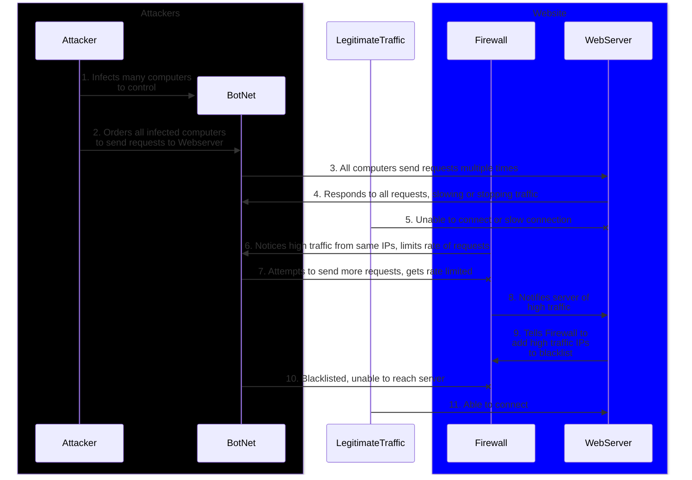

# Diagram of a small scale DDoS Attack

## Steps explained
1. A BotNet is a collection of computers infected by malware that is controlled by a central attacker
2. Botnets typically include many computers of the same kind, as the malware controlling and infecting them must work on all infected systems
3. A large amount of requests can slow a server down if the server cannot handle the amount of traffic
4. A server may be unable to tell apart malicious traffic and normal traffic at first
5. The primary goal of a DDoS attack is to disable normal functions of a victim, which for a website means stopping normal traffic
6. A firewall can limit the amount of traffic from all IPs, which may help if the firewall isn't also overwhelmed
7. The rate limit can come in the form of requiring a captcha image to be completed, or simply disallowing connection to the serve for a short time
8. Many security programs have ways to notify owners of issues, including unusual ammounts of traffic
9. If an IP is blacklisted, it will not be allowed through the firewall. This may also catch legitimate traffic attempting to reach a server during a DDoS attack, or simply during a period of high traffic, so be careful when blacklisting
10. While blacklisting is a solution, if the firewall is overwhelmed checking the IPs, it can stop normal traffic from getting through. Many attackers also have the ability to "Spoof," or fake, the IP address shown to a firewall, and can get through this way as well
11. While the shown solutions can work, they may only work on the smaller scale, and larger amounts of requests can only be handled by more powerful and more numerous hardware. More sophisticated attacks specifically target the firewall, and those have different methods of defense